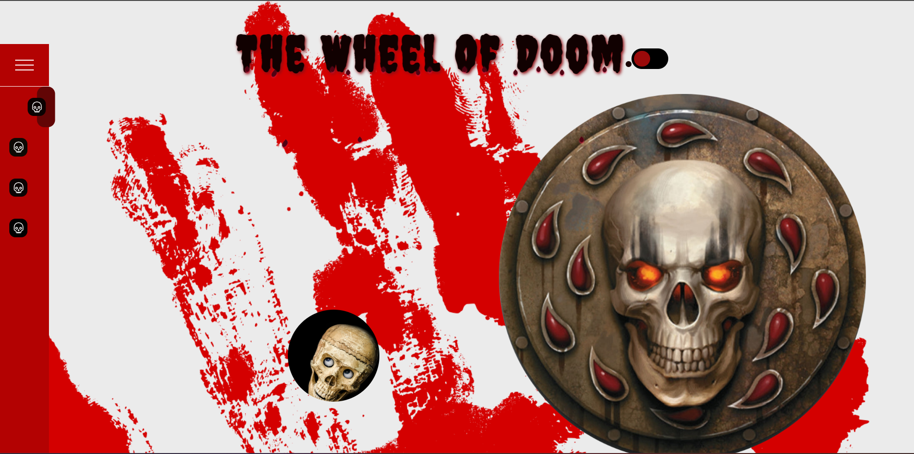

# The Wheel of Doom

Este proyecto, llamado "The Wheel of Doom," fue desarrollado como parte de un bootcamp por [Tus Nombres](https://github.com/Irina-Ichim), [Irina Ichim](https://github.com/ikramadam), y [Maribel González](https://github.com/mari19-83). Es una aplicación web interactiva que simula una ruleta de la suerte con mensajes personalizados para el usuario. Además, incluye una función de cambio de tema (modo oscuro) y efectos visuales especiales.

## Tecnologías Utilizadas

- HTML
- CSS
- JavaScript

## Funcionalidades Destacadas

- Ruleta de la suerte con mensajes aleatorios para el usuario.
- Cambio de tema (modo oscuro) para la aplicación.
- Efectos visuales de humo en un video.

## Uso

1. Clona este repositorio en tu máquina local.
2. Abre el archivo `index.html` en tu navegador para ejecutar la aplicación.

## Demo

[Ver Demo del Proyecto](Video/videoreadme.mp4)

## Contribuciones

¡Contribuciones son bienvenidas! Si deseas contribuir a este proyecto, por favor sigue los pasos:

1. Haz un fork del proyecto.
2. Crea una rama para tu nueva función: `git checkout -b nueva-funcion`
3. Realiza tus cambios y commitea: `git commit -m 'Agrega nueva función'`
4. Empuja los cambios a tu repositorio: `git push origin nueva-funcion`
5. Abre un Pull Request en este repositorio.

---
Si tienes alguna pregunta o comentario sobre el proyecto, no dudes en contactarnos.

**¡Diviértete girando la ruleta!**
